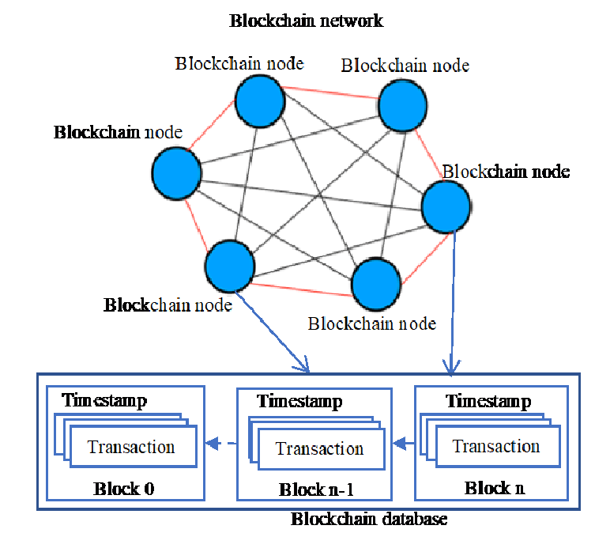
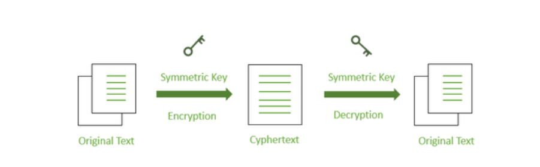
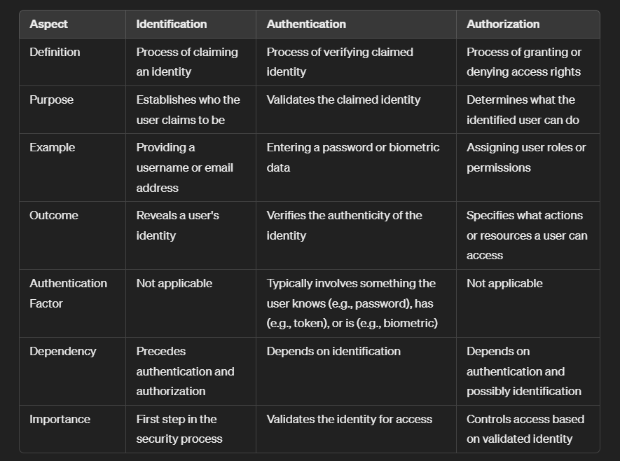
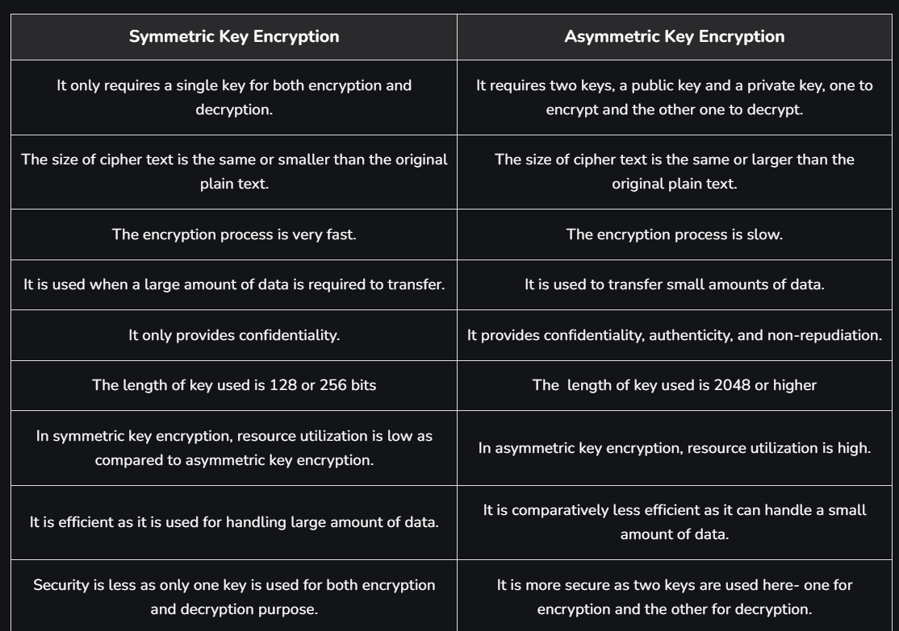
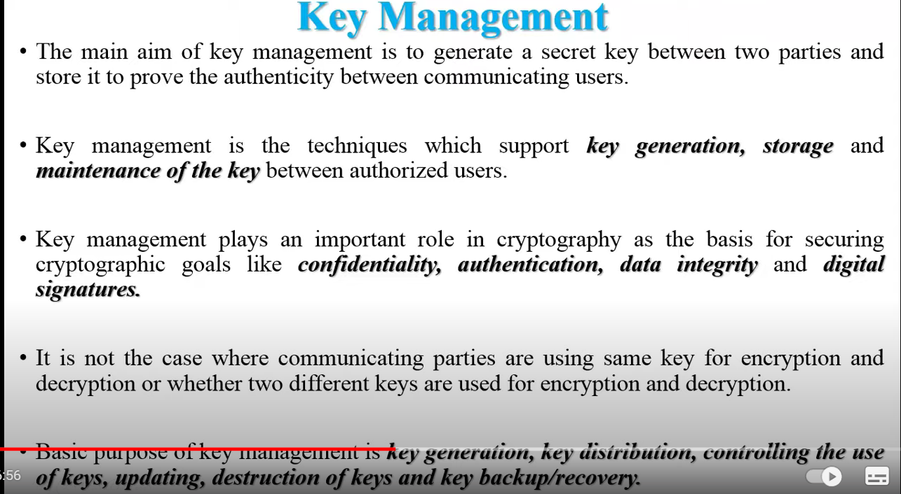
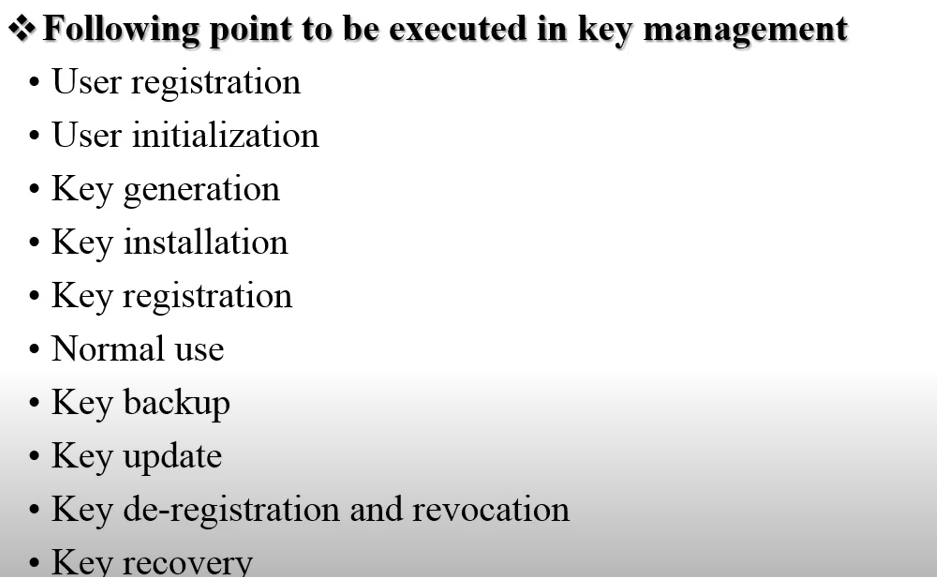
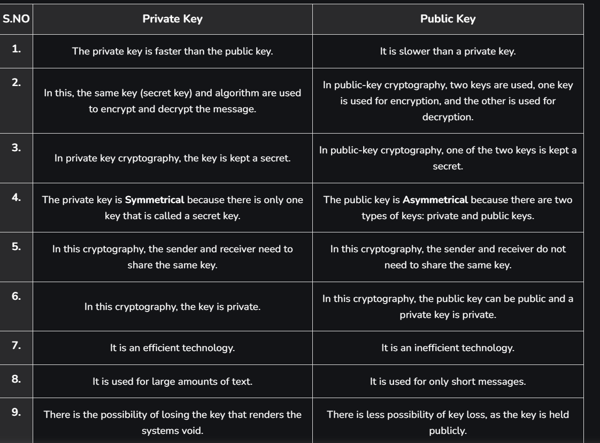
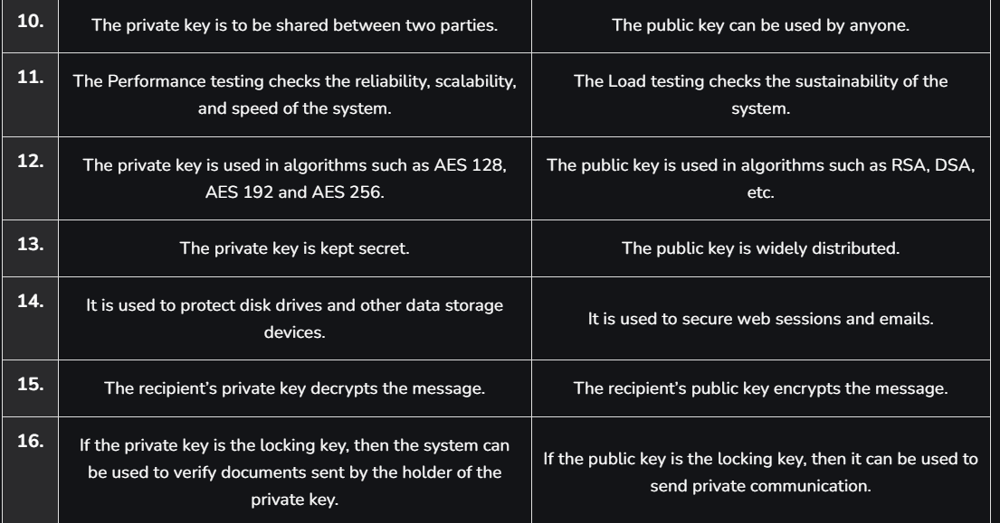

# Blockchain
- Blockchain is the decentralized digital ledger technology. 
- It is used to store transactions which are immutable, transparent and secure. 
- It consist of chain of blocks which contain cryptographic hash of previous block.
- The Key fetures blockchain include:-
    - **Decentralized**- In this Blockchain data is distributed across network of computers, Instead of central location. It reduces the risk of single point of failure.
    - **Transparency**- All transactions of the blockchain visible to all the participants.
    - **Immutability**- It can't be changed if transaction once stored.
    - **Security**- It uses cryptographic technique to secure transactions and control access to the network. Consensus mechanism like POS and Pow ensures that only valid transactions added.
- Blockchain architecture-
    
- Blockchain Components:-
    - Blocks
    - Transactions
    - Decentralized Network
    - Consensus Mechanism
    - Cryptographic hashing
    - Public/Private keys
- Application of Blockchains:-
    - Cryptocurrency
    - Voting System
    - Healthcare
    - Supply Chain Management
    - Energy Trading
    - Real Estate
- Blockchain advantages:-
    - No single point of failure
    - No middle server required
    - cost reduction
    - Immutable
    - Blockchain is open
- Disadvantages of Blockchain:-
    - Verification is required for every transaction
    - Too much consumption of Power and electricity
    - Storage Problem 

# Consensus Mechanism
- CM are Protocol that are used to ensure agreement between participents on the validity of transactions.
- Some common consensus mechanism are:-
    - **Pow(Proof of work)**- it is an algorithm.
    - it require participants, known as miners, to solve mathmatical complex puzzle to add blocks in blockchain.
    - In validating this you have to need good investment , high graphic card,etc.
    - Bitcoin uses pow.
    - Less energy efficient.
    - **Pos(Proof of stake)**-Ethereum is shifted from pow to pos.
    - Pos select validators to valdate or create new blocks on the basis of amount of cryptocurrency they hold.
    - it is more decentralized.
    
    - it inhance the scalability.
    - Less energy consumption in comapre to pow.
    - **PoA(proof of authority)**- it has limited number of trusted validators.
    - **DPoS(delegated)**- depends on the basis of delegation of votes.

# digital signature
- It is the nmathmatical technique used to validate the autheticity and integrity of message.
- How digital signature works:-
    - **Message digest**- the sender generate a unique cryptographic hash of the message using a secure hashing algorithm SHA-256. it has unnique fixed size string of charecters that represent the message.
    - **Signing**- the sende encrypted the hash using private key, creating the digital signature.
    - **Verification**- the reciever of message can verify their message using senders public key.
    
- It has several important security properties-
    - **Authentication**
    - **Integrity**

# CIA Triad

# Identification, Authenticity and Authorization

# Symmetric and assymetric Key Encryption

# Key Management

# Public and Private Key

# Hash functions
- Hashing is a process of genetating value from text or a list of numbers using mathmatical functions.
- A hash function is function that convert given numeric key to a small practical values.
- Properties of hash function:-
    - One way only
    - Any length input fixed length output
    - Small variation in input produces large variation in output
    - Collision are Possible

- There are many type of hash functions-
    - **Division method**- 
    - **Mid square**
    - **Folding Method**
    - **Multiplication Method**
- for removing collision in has fuction be uses two method- 
    - Linear probing
    - Chain rule method
- **Advantages of hash function**-
    - Data Integrity
    - fast Computation
    - Fixed size output
    - Hash Table
- **Disadvantages of hash function**-
    - Collision Vulnerability
    - One way function
    - Hashing Weakness

# Merkle Tree
     `

